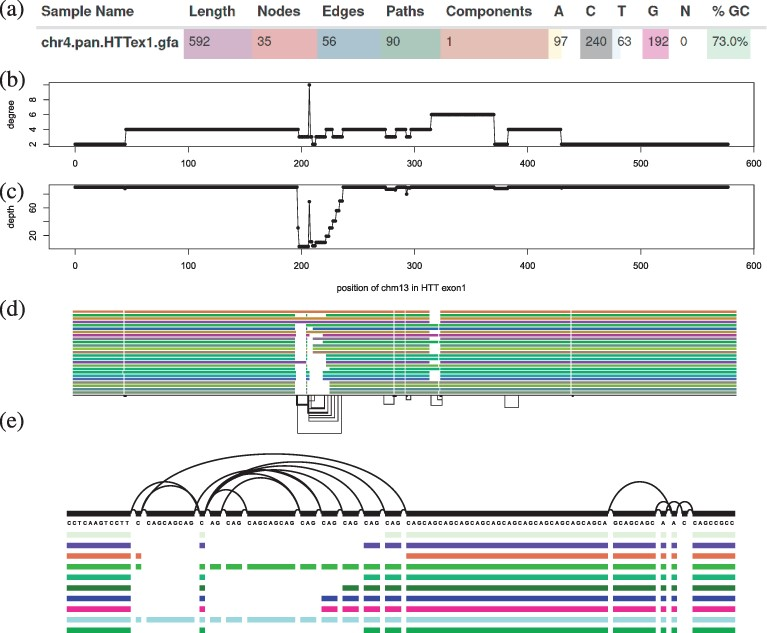
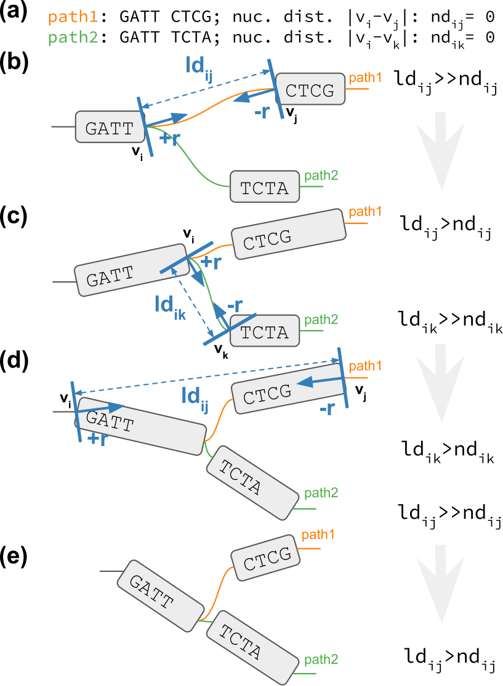

// Talks & Posters
:uri-iggsy: https://iggsy.org/
:uri-github-iggsy2024-talk: TODO nf-core_bytesize_talks_-_Cluster_scalable_pangenome_graph_construction_with_nf-core_pangenome.pdf
:uri-erik: http://hypervolu.me/~erik/erik_garrison.html
:uri-intitute-for-medical-biometry-and-bioinformatics: https://www.uniklinik-duesseldorf.de/patienten-besucher/klinikeninstitutezentren/institut-fuer-medizinische-biometrie-und-bioinformatik
:uri-germanconferencebioinformatics2021: https://dechema.converia.de/frontend/index.php?folder_id=3138&page_id=
:uri-germanconferencebioinformatics2021-abstract: https://andreaguarracino.github.io/abstracts/GCB2021_ODGIScalableToolsForPangenomeGraphs_Abstract_AndreaGuarracino.pdf
:uri-germanconferencebioinformatics2021-presentation: https://andreaguarracino.github.io/presentations/GCB2021_ODGIScalableToolsForPangenomeGraphs_Presentation_AndreaGuarracino.pdf
:uri-thebiologyofgenomes2021: https://meetings.cshl.edu/meetings.aspx?meet=GENOME&year=21
:uri-thebiologyofgenomes2021-abstract: https://andreaguarracino.github.io/abstracts/BoG2021_ThePangenomeGraphBuilder_Abstract_AndreaGuarracino.pdf
:uri-thebiologyofgenomes2021-poster: https://andreaguarracino.github.io/posters/BoG2021_ThePanGenomeGraphBuilder_Poster_AndreaGuarracino.pdf
:uri-agi2021congress: https://agi2021.centercongressi.com/programme.php
:uri-agi2021congress-abstract: https://andreaguarracino.github.io/abstracts/AGI2021_APangenomeForTheExpBXDfamOfMice_Abstract_AndreaGuarracino.pdf
:uri-agi2021congress-poster: https://andreaguarracino.github.io/posters/AGI2021_APangenomeForTheExpBXDfamOfMice_Poster_AndreaGuarracino.pdf
:uri-vcbm2020: https://www.gcpr-vmv-vcbm-2020.uni-tuebingen.de/
:uri-vcbm2020-abstract: https://andreaguarracino.github.io/abstracts/EG_VCMB_GraphLayoutByPath-GuidedStochasticGradientDescent_Abstract_AndreaGuarracino.pdf
:uri-vcbm2020-poster: https://andreaguarracino.github.io/posters/EG_VCMB_GraphLayoutByPath-GuidedStochasticGradientDescent_Poster_Landscape_AndreaGuarracino.pdf
:uri-t2thprc2020: https://www.t2t-hprc-2020conference.com/
:uri-t2thprc2020-abstract-a: https://andreaguarracino.github.io/abstracts/T2T_HPRC_GraphLayoutByPath-GuidedStochasticGradientDescent_Abstract_AndreaGuarracino.pdf
:uri-t2thprc2020-poster-a: https://andreaguarracino.github.io/posters/T2T_HPRC_GraphLayoutByPath-GuidedStochasticGradientDescent_Poster_Portrait_AndreaGuarracino.pdf
:uri-t2thprc2020-abstract-b: https://andreaguarracino.github.io/abstracts/T2T_HPRC_ScalableVariantDetectionInPangenomeModels_Abstract_AndreaGuarracino.pdf
:uri-t2thprc2020-poster-b: https://andreaguarracino.github.io/posters/BBCC2020_ScalableVariantDetectionInPangenomeModels_Poster_AndreaGuarracino.pdf
:uri-t2thprc2020-blog: https://gsocgraph.blogspot.com/2020/08/final-week-recap-of-my-gsoc-experience.html
:uri-ismb2020: https://www.iscb.org/ismb2020
:uri-ismb2020-abstract-a: https://andreaguarracino.github.io/abstracts/ISMB2020_PantographBrowsablePangenomeVisualization_Abstract_AndreaGuarracino.pdf
:uri-ismb2020-poster-a: https://andreaguarracino.github.io/posters/ISMB2020_PantographBrowsablePangenomeVisualization_Poster_AndreaGuarracino.pdf
:uri-ismb2020-abstract-b: https://andreaguarracino.github.io/abstracts/ISMB2020_SemanticVariationGraphs_OntologiesForPangenomeGraphs_Abstract_AndreaGuarracino.pdf
:uri-ismb2020-poster-b: https://andreaguarracino.github.io/posters/ISMB2020_SemanticVariationGraphs_OntologiesForPangenomeGraphs_Poster_AndreaGuarracino.pdf
:uri-ismb2020-best-poster-prize: https://www.iscb.org/ismb2020-general/ismb2020-award-winners#bio-poster
:uri-ismb2020-citation: https://publikationen.bibliothek.kit.edu/1000127608
:uri-ismb2020-abstract-c: https://andreaguarracino.github.io/abstracts/ISMB2020_ComprehensiveAnalysisSARSCoV2_Abstract_AndreaGuarracino.pdf
:uri-ismb2020-poster-c: https://andreaguarracino.github.io/posters/ISMB2020_ComprehensiveAnalysisSARSCoV2_Poster_AndreaGuarracino.pdf
:uri-swat4ls2019-poster: link:posters/SemanticGenomeGraphs-Poster.pdf
:uri-biohackathon2019: http://2019.biohackathon.org/
:uri-biohackathon2019-talk: link:talks/SH_IVoGVG_BioHackathon2019.pdf

// Publications
:uri-fellowsyates2017: https://doi.org/10.1038/s41598-017-17723-1
:uri-richardson2019:  https://doi.org/10.3389/fimmu.2019.00995
:uri-herster2019: https://doi.org/10.3389/fimmu.2019.01867
:uri-eizenga2020-a: https://doi.org/10.1146/annurev-genom-120219-080406
:uri-eizenga2020-b: https://doi.org/10.1093/bioinformatics/btaa640
:uri-ruschil2020:  https://doi.org/10.3389/fimmu.2020.606338
:uri-vasseur2022: https://doi.org/10.3389/fpls.2022.836488
:uri-heumos2022: https://doi.org/10.1186/s12935-022-02710-y
:uri-guarracino2022-odgi: https://doi.org/10.1093/bioinformatics/btac308
:uri-liao2023: https://doi.org/10.1038/s41586-023-05896-x
:uri-aly2023: https://doi.org/10.1007/s00401-023-02611-y
:uri-heumos2024: https://doi.org/10.1093/bioinformatics/btae363
:uri-balaz2024: https://doi.org/10.1007/978-3-031-55598-5_12
:uri-garrison2023-preprint: https://doi.org/10.1101/2023.04.05.535718
:uri-heumos2024-preprint: https://doi.org/10.1101/2024.05.13.593871
:uri-gabernet2024-preprint: https://doi.org/10.1101/2024.01.18.576147 

// Courses
:uri-wwl2023-invitation: https://simonheumos.github.io/blob/main/invitations/Invitation_PANGAIA_WWL2023.pdf

// Grants
:uri-ctx: https://computomics.com/home.html

// Invitations
:uri-mempang24: https://pangenome.github.io/MemPanG24/

= *Simon Heumos*
:favicon: favicon.ico
:table-stripes: even
Bioinformatician M.Sc.
:email: heumos.simon@gmail.com
:nofooter:
ifeval::["{backend}" == "html5"]
:toc: left
:toc-title: CV content
endif::[]
:icons: font
  
== icon:user[] Personal Details

I am a bioinformatician currently completing my Ph.D. at the Quantitative Biology Center in Tübingen, Germany, under Prof. Sven Nahnsen.
My research involves pangenomics and multiomics, focusing on developing innovative methods to analyze (pan)genomic variation in collaboration with Erik Garrison's virtual lab. 
I manage a range of interdisciplinary projects, including software development and the implementation of pipelines such as nf-core/pangenome, which enhances pangenomic analysis efficiency.
I provide guidance to biomedical researchers on experimental design, data analysis, and multiomics integration. 
Additionally, I lead hackathons, tutorials, and workshops, and mentor students. 
Outside of work, I enjoy an active lifestyle and watching Sesame Street for a good laugh.

[.float-group]
--
[.left]
[link=https://doi.org/10.1186/s12935-022-02710-y]
image::images/mcia.png["Heumos*, Dehn* et al. 2022, Cancer Cell International", 323]

[.left]
[link=https://doi.org/10.1093/bioinformatics/btac308]

[.left]
[link=https://doi.org/10.1093/bioinformatics/btae363]

//[.left]
//[link=https://doi.org/10.1101/2024.05.13.593871 ]
//image::images/nf-core_pangenome.png["Heumos et al. 2024, bioRxiv", 123]
--

icon:commenting[] https://matrix.to/#/@subwaystation:matrix.org[Chat] | icon:google[] https://scholar.google.com/citations?user=JBBlItoAAAAJ&hl=en[Publications] | icon:github[] https://github.com/subwaystation[Code] | icon:registered[] https://www.researchgate.net/profile/Simon-Heumos[ResearchGate] | icon:address-card[] https://orcid.org/0000-0003-3326-817X[ORCID] | icon:linkedin-square[] https://www.linkedin.com/in/simon-heumos-6a8799130/[Linkedin] | icon:twitter[] https://x.com/simonheumos[X] | image:images/nf-core_pangenome.png[link="https://doi.org/10.1101/2024.05.13.593871", 100]

== icon:suitcase[] Employment

icon:calendar[] `1 Jun. 2019 to 30 Jun. 2024` (5 years) +
icon:university[] *PhD student at the https://uni-tuebingen.de/en/research/research-infrastructure/quantitative-biology-center-qbic/[Quantitative Biology Center (QBiC)]* (Tübingen, Germany). +
icon:group[] Reporting to Prof. Sven Nahnsen.

* Cluster efficient pangenome graph construction with nf-core/pangenome (https://doi.org/10.1101/2024.05.13.593871[Heumos et al. 2024, bioRxiv]) +
(icon:github[] https://github.com/nf-core/pangenome[nf-core/pangenome])
* Valuable asset in Erik Garrison's virtual pangenome lab working closely with Erik Garrison, Andrea Guarracino, and Pjotr Prins
// ** Progressing efficient pangenome variation graph models 
// (https://doi.org/10.1093/bioinformatics/btaa640[Eizenga et al. 2020, Bioinformatics])
** https://doi.org/10.1146/annurev-genom-120219-080406[Pangenome Graphs] review 
// (https://doi.org/10.1146/annurev-genom-120219-080406[Eizenga et al. 2020, Annual Review of Genomics and Human Genetics])
** ODGI: understanding pangenome graphs (https://doi.org/10.1093/bioinformatics/btac308[Guarracino*, Heumos* et al. 2022, Bioinformatics])(icon:github[] https://github.com/pangenome/odgi[ODGI])
** Pangenome graph layout algorithm (https://doi.org/10.1093/bioinformatics/btae363[Heumos*, Guarracino* et al. 2024, Bioinformatics])(icon:github[] https://odgi.readthedocs.io/en/latest/rst/tutorials/sort_layout.html[PG-SGD])
** Associate member of the Human Pangenome Reference Consortium 
// (https://doi.org/10.1038/s41586-023-05896-x[Liao et al. 2023, Nature])
// * Evaluating pangenome graphs (https://github.com/pangenome/pgge[pgge])
* Supporting efforts for efficient pangenome graph indices 
// (https://doi.org/10.1007/978-3-031-55598-5_12[Balaz et al. 2024, LATIN2024: Theoretical Informatics])
* Experimenting towards an interface between RDF/SPARQL and pangenome graphs together with Jerven Bollemann and Toshiyuki T. Yokoyama winning an ISMB 2020 https://www.iscb.org/ismb2020-general/ismb2020-award-winners#bio-poster[Best Poster Award: _Semantic Variation Graphs: Ontologies for Pangenome Graphs_]
* Multiomics analysis of the NCI-60 tumor cell panel (https://doi.org/10.1186/s12935-022-02710-y[Heumos*, Dehn* et al. 2022, Cancer Cell International])(icon:github[] https://github.com/qbicsoftware/QMSFC[QMSFC])
* Crawling and integrating multiomics data from resources like TCGA
* Differential expression analysis of RNA-Seq data
* Integrative analysis of transcriptomic microarray data (Affymetrix)
* Curation, quality control, differential expression analysis of Fluorescence Activated Cell Sorting (FACS) data
* Proteomics and phosphoproteomics data curation, and differential expression analysis
* Reverse Phase Protein Array (RPPA) differential expression analysis
* Organizer, tutor, and chair of international hackathons and workshops
* Managing virtual machines and users in QBiC's deNBI cloud instances
* Organization of retreats
* Mentoring undergraduates
* Learning ONT sequencing and base calling at PANGAIA's Winter Wet Lab school
// * Discontinued: Development of pangenome graph browser (icon:github[] https://github.com/graph-genome/graph-genome.github.io[Pantograph])

icon:calendar[] `1 Jun. 2017 to 30 May 2019` (2 years) +
icon:university[] *Research assistant at the https://uni-tuebingen.de/en/research/research-infrastructure/quantitative-biology-center-qbic/[Quantitative Biology Center (QBiC)]* (Tübingen, Germany). +
icon:group[] Reporting to Dr. Stefan Czemmel

* Member of bioinformatics support and project management team (BioPM)
* Bridge function to the infrastructure and scientific software team
* Counseling of biomedical researchers on experimental design, data analysis, and paper writing
// (https://doi.org/10.3389/fimmu.2019.00995[Richardson et al. 2019, Frontiers in Immunology])
* FACS data analysis
// (https://doi.org/10.3389/fimmu.2019.01867[Herster et al. 2019, Frontiers in Immunology])
* Proteomics LFQ data analysis
// (https://doi.org/10.1007/s00401-023-02611-y[Aly et al. 2023, Acta Neuropathologica])
* Germline variants analyses on whole-genome sequencing (WGS) data: Quality control, read trimming and mapping, variant calling, and functional prediction
* Compilation of highly standardized and reproducible bioinformatics pipelines
* Excellent customer service when performing data processing and statistical analysis of big biomedical data
* Initiation and maintenance of a QBiC report template for analysis results
* Driving force behind standardized SOPs to improve QBiC's infrastructure
* Shaped research grant application at the Ministry for Economics and Energy (BMWi) titled PANTOGRAPH aquiring 190,000€ for researching pangenome graph visualization
* Supervision of student projects
* After 1 year: Vice coordinator of the BioPM team

icon:calendar[] `1 Nov. 2016 to 31 Mar. 2017` (6 months) +
icon:university[] *Master student at the  {uri-ctx}[Computomics GmbH]* (Tübingen, Germany) + 
icon:group[] Reporting to Björn Geigle and Dr. Jörg Hagmann +
icon:book[] Thesis _Interactive Visualization of Genome Variation Graphs_ +
icon:battery[] Evaluation: 1.0 +
icon:trophy[] ISMB 2017 Best Poster Prize _Interactive pangenome visualization using variant graphs_ +
icon:code[] Tooling: Interactive full-stack web application with Node.js, nbind to make C++ vg accessible in JavaScript, pugjs, HTML, CSS

icon:calendar[] `1 Jun. 2015 to 31 Sep. 2016` (1 year, 2 months) +
icon:university[] *Research student at the  https://www.gea.mpg.de/[Max Planck Institute for the Science of Human History]* (Jena, Germany) +
icon:group[] Reporting to Dr. Alexander Herbig in the https://www.eva.mpg.de/archaeogenetics/research-groups/computational-pathogenomics/[Computational Pathogenomics] research group

* Development of bioinformatics programs for the analysis of paleogenetic NGS data (icon:github[] https://github.com/subwaystation/TOPAS/tree/master/src/main/java/gen_con_s[GenConS]) + 
(icon:book[] https://doi.org/10.1038/s41598-017-17723-1[Fellows Yates et al. 2017, Scientific Reports])

icon:calendar[] `1 Sep. 2014 to 31 May 2015` (11 months) +
icon:university[] *Research student at the  https://uni-tuebingen.de/en/faculties/faculty-of-science/departments/geosciences/work-groups-contacts/prehistory-and-archaeological-sciences/ina/[Institute for Archaeological Sciences]* (Tübingen, Germany) +
icon:group[] Reporting to Dr. Alexander Herbig in the Paleogenetics research group

* Performance of system administration tasks and development of bioinformatics programs for the analysis of paleogenetic NGS data

icon:calendar[] `1 Jul. 2014 to 30 Aug. 2014` (1year, 1 month) +
icon:university[] *Research student at the  https://www.medizin.uni-tuebingen.de/en-de/medizinische-fakultaet[MFT Services]* (Tübingen, Germany) +
icon:group[] Reporting to Dr. Günter Jäger in the Medical Genetics research group

* Analysis of RNA-Seq data

icon:calendar[] `1 Jun. 2013 to 31 Mar. 2014` (10 months) +
icon:university[] *Research student at the  https://uni-tuebingen.de/fakultaeten/mathematisch-naturwissenschaftliche-fakultaet/fachbereiche/interfakultaere-einrichtungen/ibmi/institut/[Centre for Bioinformatics]* (Tübingen, Germany) +
icon:group[] Reporting to Prof. Kay Nieselt in the Integrative Transcriptomics research group

* Analysis of RNA-Seq data and extension of an in-house developed Java tool for the analysis of RNA-Seq data

icon:calendar[] `1 Aug. 2010 to 31 Aug. 2010` (1 month) +
icon:calendar[] `1 Aug. 2011 to 31 Aug. 2011` (1 month) +
icon:calendar[] `1 Aug. 2012 to 31 Aug. 2012` (1 month) +
icon:hand-rock-o[] *Temporary shipping assistant at https://www.waldner.de/de/[WALDNER]* (Wangen, Germany) +

* Packaging small part materials and transporting them to the loading area

icon:calendar[] `1 Jul. 2009 to 31 Mar. 2010` (9 months) +
icon:ambulance[] *Alternative service as an ambulance man at the https://www.drk-rv.de/[DRK Rettungsdienst Bodensee-Oberschwaben gGmbH]* (Ravensburg, Germany)

* Operations took place both in the ambulance and in the patient transport vehicle

icon:calendar[] `1 Feb. 2007 to 31 Jul. 2010` (3 years, 5 months) +
icon:leaf[] *Side job at the https://www.pekana.com/de-DE/[PEKANA Naturheilmittel GmbH]* (Kisslegg, Germany)

* Assistant for office, shipping, and pharmaceutical packaging tasks

== icon:book[] Publications

**first authorship*

[cols="1,3,3,1",options="header"]
|===

^| icon:newspaper-o[] Journal
^| icon:book[] Title
^| icon:pencil[] Contribution
^| icon:link[] Links

| *bioRxiv, _In review_*
| *Cluster efficient pangenome graph construction with nf-core/pangenome*
| *Pipeline conception, software development, testing, documentation, design and conduction of experiments, paper writing*
| icon:spinner[] {uri-heumos2024-preprint}[Preprint]

| PLOS Computational Biology, _Accepted_
| nf-core/airrflow: an adaptive immune receptor repertoire analysis workflow employing the Immcantation framework
| Software development, paper editing
| icon:spinner[] {uri-gabernet2024-preprint}[Preprint]

| Nature Methods, _Accepted_
| Building pangenome graphs
| Software development, documentation, testing, contributed to Figure 1, wrote Section A1, made Figure A1, and contributed to paper writing and editing
| icon:spinner[] {uri-garrison2023-preprint}[Preprint]

| *Bioinformatics, 2024*
| **Pangenome graph layout by Path-Guided Stochastic Gradient Descent*
| *Algorithm implementation leader, testing, documentation, design and conduction of experiments, paper writing*
| icon:book[] {uri-heumos2024}[Paper]

| LATIN 2024: Theoretical Informatics, 2024
| Wheeler Maps
| Advisor for the integration of a wheeler maps implementation with real life pangenome graphs, built and provided initial pangenome graphs for testing the implementation, manuscript editing
| icon:book[] {uri-balaz2024}[Paper]

| Acta Neuropathologica, 2023
| Integrative proteomics highlight presynaptic alterations and c-Jun misactivation as convergent pathomechanisms in ALS
| Paper editing, LFQ proteomics analysis
| icon:book[] {uri-aly2023}[Paper]

| Nature, 2023
| A draft human pangenome reference
| Paper editing, pangenome graph creation and visualization
| icon:book[] {uri-liao2023}[Paper]

| *Cancer Cell International, 2022*
| **Multiomics surface receptor profiling of the NCI-60 tumor cell panel uncovers novel theranostics for cancer immunotherapy*
| *Data curation and quality control, performed the MCIA, RNAseq analysis and TCPA data exploration, wrote methods sections of the software tools and steps I applied, generated visualizations for Figures 1-3, and manuscript editing*
| icon:book[] {uri-heumos2022}[Paper]

| *Bioinformatics, 2022*
| **ODGI: understanding pangenome graphs*
| *Paper and documentation writing, performance evaluation, testing, implemented several tools*
| icon:book[] {uri-guarracino2022-odgi}[Paper]

| Frontiers in Plant Science, 2022
| A Perspective on Plant Phenomics: Coupling Deep Learning and Near-Infrared Spectroscopy
| Experimental counseling, data management
| icon:book[] {uri-vasseur2022}[Paper]

| Frontiers in Immunology, 2020
| Specific Induction of Double Negative B Cells During Protective and Pathogenic Immune Responses
| Data curation
| icon:book[] {uri-ruschil2020}[Paper]

| Bioinformatics, 2020
| Efficient dynamic variation graphs
| Implementation of some ODGI subcommands (pathindex, server, panpos), optimization of one (bin), documentation writing for ODGI
| icon:book[] {uri-eizenga2020-b}[Paper]

| Annual Review of Genomics and Human Genetics, 2020
| Pangenome Graphs
| I made Table 1 and contributed to Sections 4.4 and 6.1 and Figure 2, paper editing
| icon:book[] {uri-eizenga2020-a}[Paper]

| Frontiers in Immunology, 2019
| Platelets Aggregate With Neutrophils and Promote Skin Pathology in Psoriasis
| FACS data analysis
| icon:book[] {uri-herster2019}[Paper]

| Frontiers in Immunology, 2019
| PSM Peptides From Community-Associated Methicillin-Resistant _Staphylococcus aureus_ Impair the Adaptive Immune Response via Modulation of Dendritic Cell Subsets _in vivo_
| Statistical analysis counseling, paper editing
| icon:book[] {uri-richardson2019}[Paper]

| Nature Scientific Reports, 2017
| Central European Woolly Mammoth Population Dynamics: Insights from Late Pleistocene Mitochondrial Genomes
| icon:github[] https://github.com/subwaystation/TOPAS/tree/master/src/main/java/gen_con_s[GenConS] software development and testing, wrote section about GenConS, paper editing
| icon:book[] {uri-fellowsyates2017}[Paper]

|===

== icon:bullhorn[] Talks & Posters

[cols="1,1,2,1",options="header"]
|===

^| icon:calendar[] Time
^| icon:globe[] Conference
^| icon:book[] Title
^| icon:link[] Links

| `30 June 2024 to 4 July 2024` +
| {uri-iggsy}[International Genome Graph Symposium 2024]
| Cluster efficient pangenome graph construction with nf-core/pangenome
| icon:file-pdf-o[] link:talks/nf-core_bytesize_talks_-_Cluster_scalable_pangenome_graph_construction_with_nf-core_pangenome.pdf[Talk] +
icon:file-pdf-o[] link:certificates/Certificate_of_Attendance_IGGSy2024_SimonHeumos.pdf[Certificate]

| `8 Apr. 2024` +
| HPRC https://www.hugo-hgm2024.org/[HUGO24] Workshop Rome
| Building and Analyzing Pangenome Graphs
| icon:link[] https://docs.google.com/presentation/d/1HijsejJkJ8x_pEStdOHdVnI-DzNQmhUk9I6MF20Ppsk/edit#slide=id.g2c58b14a245_0_0[Talk]

| `22 Mar. 2024` +
| https://www.medizin.uni-tuebingen.de/de/das-klinikum/einrichtungen/zentren/m3[M3 Workshop]
| Cluster efficient pangenome graph construction with nf-core/pangenome
| icon:file-pdf-o[] link:talks/M3_workshop_-_Cluster_efficient_pangenome_graph_construction_with_nf-core_pangenome.pdf[Talk]

| `7 Nov. 2023` +
| https://nf-co.re/[nf-core community], virtual
| Cluster scalable pangenome graph construction with nf-core/pangenome
| icon:link[] https://nf-co.re/events/2023/bytesize_pangenome[Bytesize:nf-core/pangenome] +
icon:youtube[] https://youtu.be/cTfPWKzTqms[Youtube] +
icon:file-pdf-o[] link:talks/nf-core_bytesize_talks_-_Cluster_scalable_pangenome_graph_construction_with_nf-core_pangenome.pdf[Talk]

| `19 Oct. 2023` +
| https://summit.nextflow.io/2023/barcelona/[Nextflow Summit 2023]
| Cluster scalable pangenome graph construction with nf-core/pangenome
| icon:youtube[] https://www.youtube.com/watch?v=6PKZCgp6C2w[Youtube] +
icon:file-pdf-o[] link:talks/Cluster_scalable_pangenome_graph_construction_with_nf-core_pangenome.pdf[Talk]

| `23 Jun. 2023` +
| https://uni-tuebingen.de/en/faculties/faculty-of-science/departments/interfaculty-facilities/ibmi/events/tuebmi/program-2023/[TÜBMI 2023] 
| Pangenome Graphs
| icon:file-pdf-o[] link:posters/23-06-23_poster_TüBMI_PangenomeGraphs.pdf[Poster]

//| `22 Feb. 2023` +
//| IBMI PhD Talks
//| Pangenome Graphs
//| icon:file-pdf-o[] link:talks/IBMI_PhD_Talk_-_February_2023_-_Simon_Heumos.pdf[Talk]

| `8 Jul. 2022` +
| https://uni-tuebingen.de/en/research/research-infrastructure/quantitative-biology-center-qbic/events/#c1551176[Biomedical Data Science Symposium]
| Pangenome Graphs
| icon:file-pdf-o[] link:posters/23-06-23_poster_TüBMI_PangenomeGraphs.pdf[Poster]

| `6 July 2022` +
| {uri-iggsy}[International Genome Graph Symposium 2022]
| Graph layout by path-guided stochastic gradient descent
| icon:file-pdf-o[] link:talks/IGGSy_2022_Talk_-_Graph_Layout_by_Path-Guided_Stochastic_Gradient_Descent.pdf.pdf[Talk] + 
(Due to a car accident, {uri-erik}[Erik Garrison] hold the talk.)

| `8 Jul. 2022` +
| https://vizbi.org/2022/[VIZBI 2022]
| Graph Layout by Path-Guided Stochastic Gradient Descent
| icon:file-pdf-o[] link:abstracts/Poster_Abstract_VIZBI_2022_-_Graph_Layout_by_Path-Guided_Stochastic_Gradient_Descent.pdf[Abstract] +
icon:file-pdf-o[] link:posters/Graph_Layout_by_Path-Guided_Stochastic_Gradient_Descent_-_Poster_-_Landscape_-_VIZBI_2022.pdf[Poster] +
icon:link[] https://www.vizbi.org/Posters/2022/vD01?email=simon.heumos%40qbic.uni-tuebingen.de[VIZBI Posters] +
icon:link[] https://www.vizbi.org/Lightning/2022/vD01?email=simon.heumos%40qbic.uni-tuebingen.de#/1[Lightning Talk]

| `21 Oct. 2021` +
| {uri-intitute-for-medical-biometry-and-bioinformatics}[Institute for Medical Biometry and Bioinformatics]
| Exploring pangenome graphs and possible applications
| icon:file-pdf-o[] link:talks/Exploring_pangenome_graphs_and_possible_applications.pdf[Talk]

| `21 Sept. 2021 to 24 Sept. 2021` +
| {uri-agi2021congress}[AGI2021 Congress]
| A pangenome for the expanded BXD family of mice
| icon:file-pdf-o[] {uri-agi2021congress-abstract}[Abstract] +
icon:file-pdf-o[] {uri-agi2021congress-poster}[Poster]

| `6 Sept. 2021 to 8 Sept. 2021` +
| {uri-germanconferencebioinformatics2021}[German Conference on Bioinformatics 2021]
| ODGI: scalable tools for pangenome graphs
| icon:file-pdf-o[] {uri-germanconferencebioinformatics2021-abstract}[Abstract] +
icon:file-pdf-o[] {uri-germanconferencebioinformatics2021-presentation}[Talk]

| `21 Jul. 2021` +
| https://uni-tuebingen.de/fakultaeten/mathematisch-naturwissenschaftliche-fakultaet/fachbereiche/interfakultaere-einrichtungen/ibmi/veranstaltungen/tuebmi/#c1816276[TüBiT 2021]
| The PanGenome Graph Builder
| icon:file-pdf-o[] link:posters/The_PanGenome_Graph_Builder_-_TüBiT_2021_Poster.pdf[Poster]

| `11 May 2021 to 14 May 2021` +
| {uri-thebiologyofgenomes2021}[The Biology of Genomes 2021]
| The PanGenome Graph Builder
| icon:file-pdf-o[] {uri-thebiologyofgenomes2021-abstract}[Abstract] +
icon:file-pdf-o[] {uri-thebiologyofgenomes2021-poster}[Poster]

| `28 Sep. 2020 to 1 Oct. 2020` +
| {uri-vcbm2020}[EG VCBM 2020]
| Graph Layout by Path-Guided Stochastic Gradient
| icon:file-pdf-o[] {uri-vcbm2020-abstract}[Abstract] +
icon:file-pdf-o[] {uri-vcbm2020-poster}[Poster]

| `21 Sep. 2020 to 23 Sep. 2020` +
| {uri-t2thprc2020}[T2T-HPRC-Virtual Conference 2020]
| Graph Layout by Path-Guided Stochastic Gradient
| icon:file-pdf-o[] {uri-t2thprc2020-abstract-a}[Abstract] +
icon:file-pdf-o[] {uri-t2thprc2020-poster-a}[Poster]

| `13 Jul. 2020 to 16 Jul. 2020` +
| {uri-ismb2020}[ISMB 2020]
| Pantograph: Scalable Interactive Graph Genome Visualization
| icon:file-pdf-o[] {uri-ismb2020-abstract-a}[Abstract] +
icon:file-pdf-o[] {uri-ismb2020-poster-a}[Poster]

| `13 Jul. 2020 to 16 Jul. 2020` +
| {uri-ismb2020}[ISMB 2020]
| Semantic Variation Graphs - A Pangenome Ontology
| icon:file-pdf-o[] {uri-ismb2020-abstract-b}[Abstract] +
icon:file-pdf-o[] {uri-ismb2020-poster-b}[Poster] +
icon:link[] {uri-ismb2020-best-poster-prize}[Best Poster Prize] +
icon:book[] {uri-ismb2020-citation}[Citation]

| `9 Dec. 2019 to 12 Dec. 2019` +
| https://www.swat4ls.org/workshops/edinburgh2019/[SWAT^4^HCLS]
| Semantic Genome Graphs
| icon:file-pdf-o[] {uri-swat4ls2019-poster}[Poster]

| `1 Sept. 2019` +
| {uri-biohackathon2019}[Japan DBCLS Biohackathon 2019 Symposium]
| VG Browser: Interactive Visualization of Genome Variation Graphs
| icon:file-pdf-o[] {uri-biohackathon2019-talk}[Talk]

|===

== icon:trophy[] Awards

[cols="1,1,2,1",options="header"]
|===

^| icon:calendar[] Time
^| icon:globe[] Place
^| icon:book[] Description
^| icon:link[] Links

|`4 Jul. 2024` +
|https://iggsy.org/[International Genome Graph Symposium 2024]
|Student Travel Award 700 CHF (720.32 EUR)
|icon:file-pdf-o[] link:certificates/TravelAward_IGGSy2024_SimonHeumos.pdf[Travel Award]

|`16 Jul. 2020` +
|https://www.iscb.org/ismb2020[ISMB 2020]
|Best Poster Award _Semantic Variation Graphs: Ontologies for Pangenome Graphs_
|icon:link[] https://www.iscb.org/ismb2020-general/ismb2020-award-winners#bio-poster[Bio-Ontologies COSI – Best Poster Award]

|`24 Jul. 2017` +
|https://www.iscb.org/ismbeccb2017[ISMB 2017]
|Best Poster Award _Interactive pangenome visualization of variant graphs_
|icon:file-pdf-o[] link:certificates/Best_Poster_Award_ISMB2017_SimonHeumos.pdf[Best Poster Award]

|`8 Oct. 2012` +
|https://2012.igem.org/Main_Page[iGEM 2012]
|Bronze Award
|icon:file-pdf-o[] https://www.youtube.com/watch?v=dQw4w9WgXcQ[MISSING]

|===

== icon:dollar[] Grants

[cols="1,1,1,2",options="header"]
|===

^| icon:calendar[] Time
^| icon:user[] Sponsor
^| icon:dollar[] Amount
^| icon:globe[] Description

|`4 July 2024`
|https://www.bmwk.de/Navigation/EN/Home/home.html[Ministry of Economics and Energy (BMWi)]
|190,000 EUR
|Research grant _Pantograph_ together with {uri-ctx}[Computomics GmbH] to research pangenome graph visualization.

|===

== icon:microphone[] Invitations

[cols="1,1,2,1",options="header"]
|===

^| icon:calendar[] Time
^| icon:globe[] Place
^| icon:book[] Description
^| icon:link[] Links

|`18 May 2024 to 22 May 2024`
|MemPanG24 Pangenomics, https://www.uthsc.edu/[University of Tennessee Health and Science Center], Memphis, USA
|Invited *Organizer*, *instructor*, and *chair*
|icon:link[] https://pangenome.github.io/MemPanG24/[Webpage] +
icon:github[] https://github.com/pangenome/MemPanG24/[Material] +
icon:file-pdf-o[] link:certificates/Certificate_SimonHeumos_MemPanG24_signed.pdf[Certificate]

|`8 Apr. 2024`
|HPRC Pangenomics Workshop at HUGO 2024, https://web.uniroma1.it/aulerettorato/home[Aula Multimediale Rettorato, Sapienza University of Rome], Rome, Italy
|Invited *Instructor*
|icon:github[] https://github.com/jmonlong/workshop-hprc-hugo24/blob/main/workshop-hprc-hugo24-landing.md[Material] +
icon:link[] https://docs.google.com/presentation/d/1HijsejJkJ8x_pEStdOHdVnI-DzNQmhUk9I6MF20Ppsk/edit#slide=id.g2c58b14a245_0_48[Slides] +
icon:file-pdf-o[] link:certificates/HGM2024_Certificate_Simon_Heumos.pdf[Certificate]

|`30 May 2023 to 2 Jun. 2023`
|MemPanG23 Pangenomics, https://www.uthsc.edu/[University of Tennessee Health and Science Center], Memphis, USA
|Invited *Organizer*, *instructor*, and *chair*
|icon:link[] https://pangenome.github.io/MemPanG23/[Webpage] +
icon:github[] https://github.com/pangenome/MemPanG23/[Material] +
icon:file-pdf-o[] link:certificates/Certificate_mempang23_SimonHeumos.pdf[Certificate]

| `7 Nov. 2023`
| nf-core community, virtual
| Invited talk nf-core bytesize talks 2023 _Cluster scalable pangenome graph construction with nf-core/pangenome_
| icon:link[] https://nf-co.re/events/2023/bytesize_pangenome[Bytesize:nf-core/pangenome] +
icon:youtube[] https://youtu.be/cTfPWKzTqms[Youtube] +
icon:file-pdf-o[] link:talks/nf-core_bytesize_talks_-_Cluster_scalable_pangenome_graph_construction_with_nf-core_pangenome.pdf[Slides]

| `21 October 2021`
| {uri-intitute-for-medical-biometry-and-bioinformatics}[Institute for Medical Biometry and Bioinformatics]
| Invited talk _Exploring pangenome graphs and possible applications_
| icon:file-pdf-o[] link:talks/Exploring_pangenome_graphs_and_possible_applications.pdf[Slides] +

|===

== icon:terminal[] Hackathons

[cols="1,1,2,1",options="header"]
|===

^| icon:calendar[] Time
^| icon:globe[] Info
^| icon:book[] What
^| icon:link[] Links 

|`18 Mar. 2024 to 20 Mar. 2024`
|https://nf-co.re/events/2024/hackathon-march-2024[nf-core hackathon], virtual
|Co-team leader group pipelines, finalizing nf-core/pangenome
|icon:github[] https://github.com/nf-core/pangenome[nf-core/pangenome]

|`16 Oct. 2023 to 18 Oct. 2023`
|https://nf-co.re/events/2023/hackathon-october-2023[nf-core hackathon], Barcelona, Spain
|Progressing nf-core/pangenome
|icon:github[] https://github.com/orgs/nf-core/projects/47/views/4[projects] +
icon:github[] https://github.com/nf-core/pangenome[nf-core/pangenome]

|`27 Mar. 2023 to 29 Mar. 2023`
|https://nf-co.re/events/2023/hackathon-march-2023[nf-core hackathon], virtual
|Progressing nf-core/pangenome
|icon:github[] https://github.com/orgs/nf-core/projects/38/views/16[projects] +
icon:github[] https://github.com/nf-core/pangenome[nf-core/pangenome]

|`16 Mar. 2022 to 18 Mar. 2022`
|https://nf-co.re/events/2022/hackathon-march-2022[nf-core hackathon], virtual
|Progressing nf-core/pangenome
|icon:github[] https://github.com/nf-core/pangenome[nf-core/pangenome]

|`9 Dez. 2021 to 10 Dez. 2021`
|https://pgbh2021.pangenome.eu/[Pangenomics BioHacking], Online, Virtual in Milano
|Expert for pangenome graph construction and participant
|icon:link[] https://matrix.to/#/#nf-core_pangenome:matrix.org[nf-core/pangenome matrix] + 
icon:file-pdf-o[] link:certificates/pgbh2021-certificate-Heumos_Simon.pdf[Certificate]

|`8 Nov. 2021 to 12 Nov. 2021`
|https://2021.biohackathon-europe.org/[ELIXIR Europe Biohackathon], Barcelona, Spain
|Progressing nf-core/pangenome
|icon:github[] https://github.com/nf-core/pangenome[nf-core/pangenome]

|`22 Mar. 2021 to 24 Mar. 2021`
|https://nf-co.re/events/2021/hackathon-march-2021[nf-core hackathon], virtual
|Starting nf-core/pangenome
|icon:github[] https://github.com/orgs/nf-core/projects/13[Projects] + 
icon:link[] https://hackmd.io/Aw3d57wWRH6s5n4tHMBlag?both[HackMD] +
icon:github[] https://github.com/nf-core/pangenome[nf-core/pangenome]

|`9 Nov. 2020 to 13 Nov. 2020`
|https://2020.biohackathon-europe.org/[ELIXIR Europe Biohackathon], virtual
|Project leader _Federated Interoperable Annotated Variation Graphs_
|icon:link[] https://2020.biohackathon-europe.org/projects.html[Projects] +
icon:github[] https://github.com/elixir-europe/BioHackathon-projects-2020/tree/master/projects/25[Federated Interoperable Annotated Variation Graphs]

|`2 Aug. 2020 to 14 Aug. 2020`
|Crusco Biohackathon, Lavello, Italy
|Progressing PG-SGD with Andrea Guarracino and Erik Garrison
|icon:github[] https://github.com/pangenome/odgi/blob/master/src/algorithms/path_sgd.cpp[1D PG-SGD] +
icon:github[] https://github.com/pangenome/odgi/blob/master/src/algorithms/path_sgd_layout.cpp[2D PG-SGD]

|`5 Apr. 2020 to 11 Apr. 2020`
|https://github.com/virtual-biohackathons/covid-19-bh20[COVID-19 Biohackathon], virtual
|Co-Project leader Pangenome Browser and co-project leader Pangenome Ontology
|icon:github[] https://github.com/virtual-biohackathons/covid-19-bh20[COVID-19 Biohackathon 2020] +
icon:github[] https://github.com/virtual-biohackathons/covid-19-bh20/wiki/Pangenome-Browser[Pangenome Browser] +
icon:github[] https://github.com/graph-genome/MatrixTubeMap/tree/splitsparql2[Semantic Variation Graphs]

|`21 Nov. 2019 to 26 Nov. 2019`
|{uri-ctx}[Computomics GmbH], Tübingen, Germany
|Progressing Pantograph, playing around with pangenome graphs and SPARQL
|icon:github[] https://github.com/graph-genome[Graph-Genome]

|`1 Sep. 2019 to 7 Sep. 2019`
|https://biosciencedbc.jp/en/[NBDC] https://dbcls.rois.ac.jp/index-en.html[DBCLS] http://2019.biohackathon.org/[BioHackathon 2019], Fukuoka, Japan
|Co-Project leader Pantograph, playing around with SequenceTubeMap and SPARQL
|icon:github[] https://github.com/dbcls/bh19/wiki[Hackathon Wiki] +
icon:github[] https://github.com/dbcls/bh19/wiki/BH19-Projects#genome-graphs-as-a-framework-for-precision-medicine[Project Overview] +
icon:github[] https://github.com/graph-genome[Graph-Genome] +
icon:github[] https://github.com/graph-genome/MatrixTubeMap[MatrixTubeMap] +
icon:twitter[] https://x.com/simonheumos/status/1169884828860239874[A SPARQLing MatrixTubeMap] +
icon:file-pdf-o[] link:certificates/Certificate_Biohackathon2019_SimonHeumos.pdf[Certificate]

|===

== icon:keyboard-o[] Programming Languages

[cols="1,1,1",options="header"]
|===

^| icon:calendar[] Start
^| icon:keyboard-o[] Language
^| icon:line-chart[] Strength

|`1 Oct. 2010`
|Scheme
|icon:car[]

|`1 Apr. 2011`
|Java
|icon:car[]

|`1 Apr. 2011`
|Bash
|icon:rocket[]

|`1 Oct. 2012`
|R
|icon:plane[]

|`1 Oct. 2012`
|Python
|icon:train[]

|`5 Nov. 2016`
|Javascript
|icon:bus[]

|`5 Nov. 2016`
|C++
|icon:rocket[]

|`1 Nov. 2020`
|Nextflow
|icon:space-shuttle[]

|`26 Jan. 2021`
|Rust
|icon:taxi[]

|===

== icon:users[] Teaching

[cols="5,12,8,4",options="header"]
|===

^| icon:calendar[] Time
^| icon:book[] Course
^| icon:pencil[] Role
^| icon:link[] Links

|`18 May 2024 to 22 May 2024`
|MemPanG24 Pangenomics, https://www.uthsc.edu/[University of Tennessee Health and Science Center], Memphis, USA
|*Organizer*, *instructor*, and *chair*, created new material and tutorials, held lessons, assisted the participants, tested the VMs
|icon:link[] https://pangenome.github.io/MemPanG24/[Webpage] +
icon:github[] https://github.com/pangenome/MemPanG24/[Material] +
icon:file-pdf-o[] link:certificates/Certificate_SimonHeumos_MemPanG24_signed.pdf[Certificate]

|`8 Apr. 2024`
|HPRC Pangenomics Workshop at HUGO 2024, https://web.uniroma1.it/aulerettorato/home[Aula Multimediale Rettorato, Sapienza University of Rome], Rome, Italy
|*Instructor*, updated material and tutorials, held lessons, assisted the participants
|icon:github[] https://github.com/jmonlong/workshop-hprc-hugo24/blob/main/workshop-hprc-hugo24-landing.md[Material] +
icon:link[] https://docs.google.com/presentation/d/1HijsejJkJ8x_pEStdOHdVnI-DzNQmhUk9I6MF20Ppsk/edit#slide=id.g2c58b14a245_0_48[Slides] +
icon:file-pdf-o[] link:certificates/HGM2024_Certificate_Simon_Heumos.pdf[Certificate]

|`22 Mar. 2024`
|M3 Pangenome Workshop, https://www.medizin.uni-tuebingen.de/de/das-klinikum/einrichtungen/zentren/m3[M3 Research Center, University of Tübingen], Tübingen, Germany
|*Speaker*, live demonstration of https://nf-co.re/pangenome/[nf-core/pangenome]
|icon:file-pdf-o[] link:slides/M3_workshop-Cluster_efficient_pangenome_graph_construction_with_nf-core_pangenome.pdf[Slides]

|`30 May 2023 to 2 Jun. 2023`
|MemPanG23 Pangenomics, https://www.uthsc.edu/[University of Tennessee Health and Science Center], Memphis, USA
|*Organizer*, *instructor*, and *chair*, created new material and tutorials, held lessons, assisted the participants
|icon:link[] https://pangenome.github.io/MemPanG23/[Webpage] +
icon:github[] https://github.com/pangenome/MemPanG23/[Material] +
icon:file-pdf-o[] link:certificates/Certificate_mempang23_SimonHeumos.pdf[Certificate]

|`17 Apr. 2023 to 29 Jul. 2023`
|Biomedical Data Management, https://uni-tuebingen.de/forschung/forschungsinfrastruktur/zentrum-fuer-quantitative-biologie-qbic/[University of Tübingen, Quantitative Biology Center (QBiC)], Tübingen, Germany
|*Tutor*, managed seminar, hold tutorials, exam assistant
|NA

|`19 Apr. 2022 to 30 Jul. 2022`
|Grundlagen der Bioinformatik, https://uni-tuebingen.de/forschung/forschungsinfrastruktur/zentrum-fuer-quantitative-biologie-qbic/[University of Tübingen, Quantitative Biology Center (QBiC)], Tübingen, Germany
|*Tutor*, hold tutorials, revied and updated practical lessons, exam grader
|icon:link[] https://uni-tuebingen.de/fakultaeten/mathematisch-naturwissenschaftliche-fakultaet/fachbereiche/informatik/lehrstuehle/integrative-transkriptomik/lehre/lehre-in-vorherigen-semestern/[Teaching]

|`21 Mar. to 25 Mar. 2022`
|Advanced Bioinformatics: Data Mining and Data Integration for Life Science (1.5 CFU/ECTS), Master’s degree, https://ubc.uu.nl/[Utrecht Bioinformatics Center], Utrecht, Netherlands)
|*Tutor*, assisting students in the practical lessons
|icon:link[] https://osiris-student.uu.nl/onderwijscatalogus/extern/cursus?cursuscode=BMB502114&taal=en&collegejaar=2021[Webpage]

|`20 Apr. 2020 to 25 Jul. 2020`
|Data Management for Quantitative Biology, https://uni-tuebingen.de/forschung/forschungsinfrastruktur/zentrum-fuer-quantitative-biologie-qbic/[University of Tübingen, Quantitative Biology Center (QBiC)], Tübingen, Germany
|*Tutor*, managed seminar, hold tutorials, exam assistant
|NA

|===

== icon:handshake-o[] Mentoring

[cols="1,1,1,1",options="header"]
|===

^| icon:calendar[] Time
^| icon:university[] University
^| icon:book[] Thesis
^| icon:link[] Links

|`1 Oct. 2023 to 31 Mar. 2024`
|Master's degree in Bioinformatics, https://uni-tuebingen.de/forschung/forschungsinfrastruktur/zentrum-fuer-quantitative-biologie-qbic/[University of Tübingen, Quantitative Biology Center (QBiC)], Tübingen, Germany
|Joining medical data and pangenome graphs using the semantic web
|icon:github[] https://github.com/heringerp/oxiqle[OXIQLE]

|`1 May 2023 to 30 Aug. 2023`
|Bachelor's degree in Bioinformatics, https://uni-tuebingen.de/forschung/forschungsinfrastruktur/zentrum-fuer-quantitative-biologie-qbic/[University of Tübingen, Quantitative Biology Center (QBiC)], Tübingen, Germany
|Die Konstruktion eines _Lodderomyces elongisporus_ Pangenomgraphen
|NA

|===
 
== icon:pencil[] Courses

[cols="1,1,2,1",options="header"]
|===

^| icon:calendar[] Time
^| icon:globe[] Place
^| icon:book[] Title
^| icon:link[] Links

|`1 Feb. 2023 to 8 Feb. 2023`
|https://uniba.sk/en/[Comenius University in Bratislava], https://fns.uniba.sk/en[Faculty of Natural Sciences] (wet lab), and https://fmph.uniba.sk/en[Faculty of Mathematics, Physics and Informatics] (analysis), Bratislava, Slovakia
|PANGAIA Winter Wet Lab School
|icon:link[]https://www.pangenome.eu/alpaca-pangaia-winter-wet-lab-school/[PANGAIA WWL School 2023] +
icon:file-pdf-o[] link:certificates/Invitation_PANGAIA_WWL2023.pdf[Invitation]

|`8 Jul. 2022`
|https://uni-tuebingen.de/forschung/forschungsinfrastruktur/zentrum-fuer-quantitative-biologie-qbic/[University of Tübingen, Quantitative Biology Center (QBiC)], Tübingen, Germany
|Biomedical Data Science Symposium
|icon:link[]https://uni-tuebingen.de/en/research/research-infrastructure/quantitative-biology-center-qbic/events/#c1551176[Biomedical Data Science Symposium 2022]

|`11 Apr. 2019 to 12 Apr. 2019`
|https://uni-tuebingen.de/forschung/forschungsinfrastruktur/zentrum-fuer-quantitative-biologie-qbic/[University of Tübingen, Quantitative Biology Center (QBiC)], Tübingen, Germany
|Nextflow Workshop
|icon:link[]https://uni-tuebingen.de/en/research/research-infrastructure/quantitative-biology-center-qbic/events/#c1030545[Nextflow Workshop April 2019]

|`12 Nov. 2017 to 14 Nov. 2017`
|https://www.embl.org/sites/heidelberg/[EMBL Heidelberg, Germany]
|EMBO \| EMBL Symposium: From Single- to Multiomics: Applications and Challenges in Data Integration
|icon:file-pdf-o[] link:certificates/EMBL_Certificate_of_Participation_Orange_20171116093650189.pdf[Certificate]

|`25 Sep. 2017 to 29 Sep. 2017`
|https://www.ipb-halle.de/en/[Leibniz​ ​Institute​ ​of​ ​Plant​ ​Biochemistry], Halle (Saale)
|Joint​ ​CIBI​ ​user​ ​meeting​ ​2017​ ​on​ ​OpenMS, MetFrag​ ​and​ ​SeqAn
|icon:file-pdf-o[] link:certificates/CIBI_UM_2017_Certificate_Simon_Heumos.pdf[Certificate]

|`18 Sep. 2017`
|https://uni-tuebingen.de/forschung/forschungsinfrastruktur/zentrum-fuer-quantitative-biologie-qbic/[University of Tübingen, Quantitative Biology Center (QBiC)], Tübingen, Germany
|2^nd^ Annual European Bioinformatics Core Community Workshop
|icon:file-pdf-o[] link:certificates/Certificate_of_Participation_Heumos_AEBCC_2017.pdf[Certificate]

|`5 Oct. 2012 to 8 Oct. 2012`
|https://vu.nl/nl[Vrije Universiteit], Amsterdam, Netherlands
|iGEM 2012 European Regional Jamboree   
|icon:link[] https://2012.igem.org/Team:Tuebingen[Wiki]

|===

== icon:cloud[] Misc

[cols="1,1,2,1",options="header"]
|===

^| icon:calendar[] Time
^| icon:globe[] Info
^| icon:book[] What
^| icon:link[] Links 

|`13 Jun. 2024 to Present`
|https://www.ukri.org/[United Kingdom Research and Innovation]
|Reviewer for *UK Research and Innovation*
|icon:link[] https://funding-service.ukri.org/signIn[Funding Service]

|`15 Jun. 2022 to Present`
|https://academic.oup.com/bioinformatics[Oxford Bioinformatics]
|Reviewer for *Oxford Bioinformatics*
|NA

|`12 Oct. 2020 to Present`
|https://humanpangenome.org/[Human Pangenome Reference Consortium]
|Associate Member of the *Human Pangenome Reference Consortium*
|icon:link[] https://www.nature.com/collections/aebdjihcda[Collection]

|===

